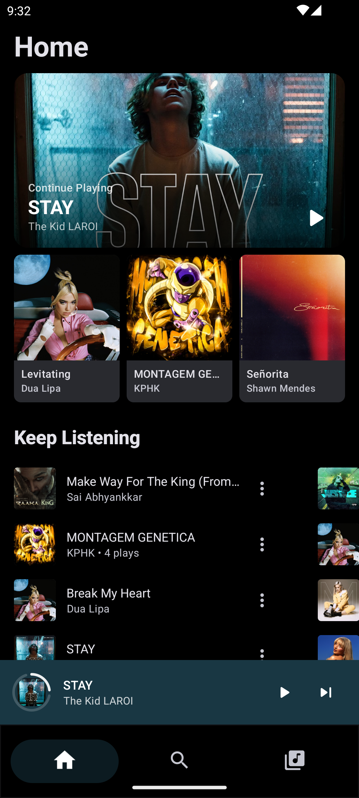
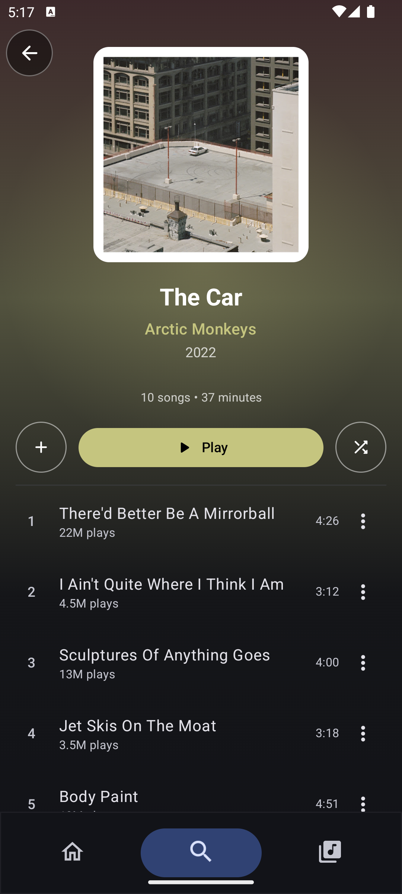
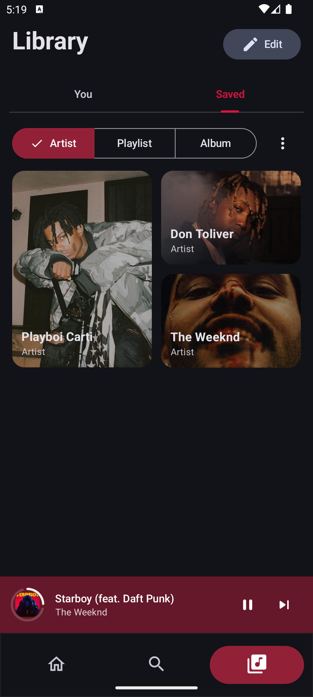
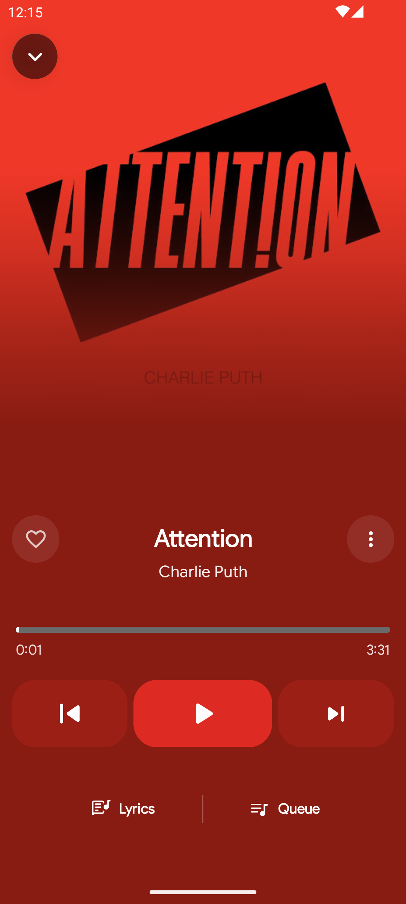
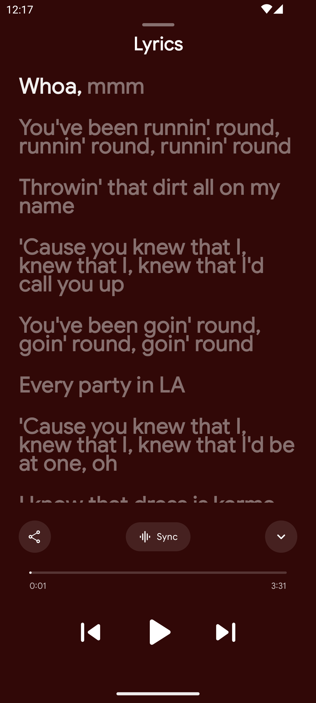
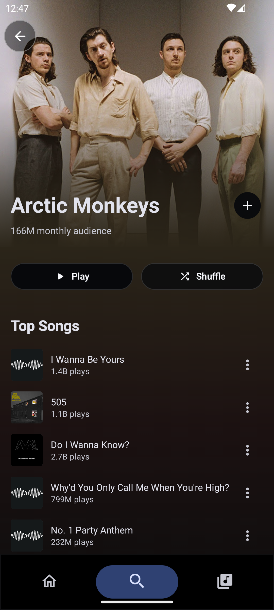

# Musicality

A modern, feature-rich Android music player that brings millions of songs, albums, and playlists to your fingertips — beautifully.

 

  

  
  
  

  
  
  

---

## What You Get

Musicality is built around the idea that your music experience should feel effortless. Stream, discover, and organize music with a clean interface and powerful playback engine — no compromises.

---

## Features

### Personalized Home Feed
- Curated recommendations tailored to your taste
- Quick picks and recently played content at a glance
- Jump straight to your favorite artists, albums, or playlists

### Search & Discovery
- Search across songs, artists, albums, and playlists instantly
- Browse by mood — *Feel Good*, *Focus*, *Energy*, and more
- Explore trending charts and top hits

### Your Library
- Access your liked songs, saved albums, and playlists in one place
- Full listening history so you never lose track of what you loved
- Offline access for saved content

### Playback Experience
- Full-screen player with album art, lyrics, and smooth controls
- **Crossfade** between tracks for seamless listening
- Repeat one, repeat all, or shuffle — your choice
- Background playback with lockscreen and notification controls
- Mini player always within reach while you browse

### Artist & Album Pages
- Deep-dive into any artist's discography and top tracks
- Full album views with track listings
- Similar artist suggestions to keep discovering

### More
- "Play Next" and "Add to Queue" from anywhere in the app
- Offline caching for faster load times
- Dynamic dark theme with colors pulled from album art

---

## Getting Started

### Requirements
- Android 10+ (API 29)
- Android Studio Hedgehog or newer

### Installation
1. **Download** the latest APK from the [Releases page](https://github.com/rishi0810/Musicality-App/releases/)
2. Enable **Install from Unknown Sources** on your device
3. Install and enjoy

> **For developers:** Clone the repo, open in Android Studio, and run on a device or emulator. Requires Android SDK 34+, Kotlin 1.9+, and Gradle 8+.
